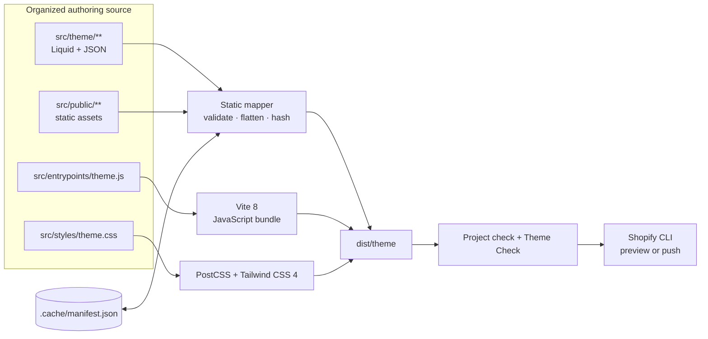

<p align="center">
  
</p>

<p align="center">
  <strong>A source-first workshop for building fast, maintainable Shopify themes.</strong>
</p>

<p align="center">
  
  
  
  
  <a href="LICENSE"></a>
</p>

## Why Liquid Loom exists

Shopify wants a flat, deployment-ready theme with directories such as `sections/`, `snippets/`, and `assets/`. Developers want feature-oriented source code, modern bundling, fast feedback, and checks they can trust.

Liquid Loom gives both sides what they need:

- Author nested, readable source without fighting Shopify's output shape.
- Compile JavaScript and CSS through Vite 8, PostCSS, and Tailwind CSS 4.
- Skip unchanged static files through content-hash caching.
- Catch flattened filename collisions before a build can overwrite anything.
- Produce a clean `dist/theme/` directory that Shopify CLI can serve or push directly.
- Validate the framework with unit tests, coverage thresholds, Prettier, build checks, Shopify Theme Check, and a public-readiness scan.

This is not a repackaged production storefront. It is an intentionally small development framework plus a merchant-neutral reference theme: enough real commerce surface area to prove the workflow, without private integrations, store data, credentials, analytics, or business-specific code.

## Quick start

Requirements:

- Node.js 22.12 or newer
- Corepack (included with supported Node releases)
- A Shopify development store for live preview and deployment

```bash
git clone <your-repository-url> liquid-loom
cd liquid-loom

corepack enable
pnpm install
pnpm build
```

Authenticate once, then start the combined build watcher and Shopify preview:

```bash
pnpm exec shopify auth login
pnpm dev
```

If you only want local compilation, use `pnpm watch`. If you prefer two terminals, run `pnpm watch` and `pnpm shopify:dev` separately.

## The build in one picture



The static mapper and the asset compiler have deliberately separate responsibilities. Liquid, JSON, and public files follow the Shopify mapping contract; JavaScript and CSS stay in normal frontend source directories and are owned by Vite.

## Source-to-output contract

| Author here                                  | Build result                                  | Behavior                                    |
| -------------------------------------------- | --------------------------------------------- | ------------------------------------------- |
| `src/theme/sections/home/hero.liquid`        | `dist/theme/sections/hero.liquid`             | Nested authoring path is flattened          |
| `src/theme/snippets/product/price.liquid`    | `dist/theme/snippets/price.liquid`            | Nested authoring path is flattened          |
| `src/theme/templates/customers/account.json` | `dist/theme/templates/customers/account.json` | Supported nested template path is preserved |
| `src/theme/config/settings_schema.json`      | `dist/theme/config/settings_schema.json`      | Relative path is preserved                  |
| `src/public/icons/cart.svg`                  | `dist/theme/assets/cart.svg`                  | Public asset path is flattened              |
| `src/entrypoints/theme.js`                   | `dist/theme/assets/theme.js`                  | Bundled and minified by Vite                |
| `src/styles/theme.css`                       | `dist/theme/assets/style.css`                 | Tailwind/PostCSS output                     |

Shopify's `layout`, `sections`, `snippets`, `blocks`, and `assets` directories are flat. If two organized source files would resolve to the same destination, Liquid Loom raises a `BuildCollisionError` before copying either file. Silent last-write-wins behavior is never allowed.

## Repository anatomy

```text
liquid-loom/
├── build-scripts/
│   ├── cli.js                    # build, watch, dev, clean, check, analyze
│   └── lib/
│       ├── public-readiness.js   # legacy-content release gate
│       └── theme-builder.js      # mapping, hashing, cache, safety guards
├── docs/
│   ├── brand-board.png           # visual identity direction
│   └── liquid-loom.svg           # editable repository wordmark
├── src/
│   ├── entrypoints/theme.js      # browser behavior entrypoint
│   ├── public/                   # static files copied to theme assets
│   ├── styles/theme.css          # Tailwind + authored theme styles
│   └── theme/
│       ├── config/
│       ├── layout/
│       ├── locales/
│       ├── sections/             # organize freely by feature
│       ├── snippets/             # organize freely by feature
│       └── templates/
├── tests/                        # Node test runner, no test framework overhead
├── dist/theme/                   # generated; never edit or commit
└── .cache/manifest.json          # generated content-hash manifest
```

## Commands

| Command              | Purpose                                                           |
| -------------------- | ----------------------------------------------------------------- |
| `pnpm dev`           | Clean development build, watch source, launch `shopify theme dev` |
| `pnpm watch`         | Build and watch without launching Shopify CLI                     |
| `pnpm build`         | Incremental production build                                      |
| `pnpm build:clean`   | Production build from an empty output directory                   |
| `pnpm clean`         | Remove `dist/theme` and `.cache` through guarded paths            |
| `pnpm analyze`       | Report file counts, output size by type, and largest files        |
| `pnpm check`         | Validate required source, JSON syntax, and required build output  |
| `pnpm theme-check`   | Run Shopify's recommended Theme Check rules against the build     |
| `pnpm public-ready`  | Scan filenames and source text for excluded legacy terms          |
| `pnpm test`          | Run unit and integration tests with Node's built-in test runner   |
| `pnpm test:coverage` | Enforce at least 80% line, branch, and function coverage          |
| `pnpm format`        | Format JavaScript, JSON, Markdown, CSS, and Liquid                |
| `pnpm validate`      | Reproduce the complete CI quality gate locally                    |

The CLI reports useful work rather than noisy activity. A typical incremental build looks like this:

```text
LIQUID LOOM · production build
✓ 27 theme files · 0 copied · 27 cached · 0 removed · 21.4 KiB · 1.85s
output dist/theme
```

## What makes the build system dependable

### Deterministic mapping

Every supported source path has one predictable destination. The mapping is centralized in `build-scripts/lib/theme-builder.js`, covered by tests, and documented above.

### Content-addressed incremental builds

The manifest stores SHA-256 fingerprints, output paths, and byte sizes. An unchanged file is skipped only when both its fingerprint and destination match and the output still exists. Modified files are refreshed; deleted source files remove their stale output.

### Safe clean operations

Before a clean build or `pnpm clean`, the builder resolves the project, source, and output paths. It rejects the project root, the source tree, and any path outside the repository as an output target.

### Atomic cache writes

The next manifest is written to a process-specific temporary file and renamed into place only after a successful static build. An interrupted process cannot leave a half-written cache pretending to be valid.

### Output collision detection

Feature-oriented folders are useful only if flattening remains safe. The complete copy plan is built and checked for duplicate destinations before any source file is written.

### A release gate for accidental legacy content

`pnpm public-ready` checks every repository filename plus the contents of public text formats, while excluding generated output, dependencies, cache data, and Git internals. It reports locations without echoing the excluded value into CI logs.

## The reference theme

The included Online Store 2.0 starter is deliberately useful but restrained. It demonstrates:

- JSON templates and editable header/footer section groups
- Home, product, collection, cart, page, search, and 404 surfaces
- Responsive product grids and image handling
- Theme settings exposed as CSS custom properties
- Semantic navigation, skip links, visible focus states, reduced-motion support, and keyboard-closeable mobile navigation
- Progressive enhancement: product and cart forms remain standard Shopify forms; JavaScript adds only menu and quantity behavior
- A Vite entrypoint that imports Tailwind CSS 4 and authored component styles

It does not dictate a vertical, visual identity, app stack, analytics provider, customer workflow, or deployment environment. Replace the reference presentation; keep the build contract.

## Daily workflow

1. Add or edit files under `src/`.
2. Keep related sections and snippets together in nested feature folders.
3. Let `pnpm dev` rebuild the deployable theme and Shopify preview.
4. Run `pnpm validate` before opening a pull request.
5. Push only `dist/theme` through Shopify CLI; never edit generated output.

To add another bundled entrypoint, extend `rollupOptions.input` in `vite.config.js`. To support a new static source category, update the mapping contract and write the failing test first.

## Quality baseline

The repository currently verifies:

- 15 passing tests
- 96.92% line coverage
- 91.67% branch coverage
- 100% function coverage
- zero Shopify Theme Check offenses in the generated starter
- clean production and incremental builds on Windows, using platform-neutral Node APIs in the framework itself

CI runs on Node 24 and executes the same `pnpm validate` command documented for contributors.

## Design principles

- **Source is the product.** Generated theme files are disposable artifacts.
- **Failures should be early and specific.** Invalid paths, incomplete themes, malformed JSON, and collisions stop the build with actionable errors.
- **Modern tooling should respect the platform.** Vite and Tailwind enhance the workflow without disguising Shopify's actual runtime.
- **Defaults should teach good habits.** The starter favors semantic HTML, progressive enhancement, responsive images, and editable theme settings.
- **Public code should be portable.** No store identifiers, credentials, private services, absolute project paths, or hidden production dependencies.

## Contributing

Issues and focused pull requests are welcome. Read [CONTRIBUTING.md](CONTRIBUTING.md) for setup, test expectations, and the source-mapping rules. Please report security issues through the process in [SECURITY.md](SECURITY.md), not a public issue.

## Identity

The mark combines two structural `L` forms with a horizontal shuttle: organized source threads becoming one deployable theme. Mint represents active build work, warm white represents structure, and coral is reserved for exceptions that need attention.

<p align="center">
  
</p>

## License

[MIT](LICENSE) © 2026 Liquid Loom contributors.

Built on the public ecosystems around [Shopify themes](https://shopify.dev/docs/storefronts/themes), [Liquid](https://shopify.dev/docs/api/liquid), [Vite](https://vite.dev/), and [Tailwind CSS](https://tailwindcss.com/).
