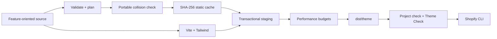

<p align="center">
  
</p>

<p align="center"><strong>Organize Shopify themes like applications. Ship them like Shopify expects.</strong></p>

<p align="center">
  <a href="https://github.com/yotamon/Liquid-Loom/actions/workflows/ci.yml"></a>
  <a href="https://github.com/yotamon/Liquid-Loom/actions/workflows/codeql.yml"></a>
  
  
  
  <a href="LICENSE"></a>
</p>

Liquid Loom is a source-first toolchain for custom Shopify themes. It lets developers keep Liquid, blocks, snippets, scripts, and styles in a feature-oriented source tree, then produces the exact flat structure Shopify expects—with deterministic mapping, collision-safe builds, modern asset compilation, and release-grade validation.

It includes two packages and one merchant-neutral reference storefront:

- `liquid-loom`: the build, watch, doctor, check, and analysis CLI.
- `create-liquid-loom`: an atomic project scaffolder.
- A production-minded Online Store 2.0 starter with theme blocks, filtering, predictive search, variants, selling plans, accessibility, and progressive enhancement.

## Start a theme

The `create-liquid-loom` package is validated and ready for the first `0.1.0` provenance-backed npm release. Until the repository owner completes npm’s one-time trusted-publisher connection, clone the template directly:

```bash
git clone https://github.com/yotamon/Liquid-Loom.git my-storefront
cd my-storefront
corepack enable
pnpm install
pnpm dev
```

After `0.1.0` is published, new projects can use the atomic scaffolder:

```bash
corepack enable
pnpm create liquid-loom@latest my-storefront
cd my-storefront
pnpm dev
```

`pnpm dev` builds the deployable theme, watches source files, and launches `shopify theme dev`. A Shopify development store is only required for live preview; builds, tests, diagnostics, and Theme Check remain local.

To contribute to the framework itself:

```bash
git clone https://github.com/yotamon/Liquid-Loom.git
cd Liquid-Loom
corepack enable
pnpm install
pnpm validate
```

## Why it exists

Shopify deploys a flat theme:

```text
sections/hero.liquid
snippets/price.liquid
assets/theme.js
```

Teams maintain software more comfortably by feature:

```text
src/theme/sections/home/hero.liquid
src/theme/snippets/product/price.liquid
src/entrypoints/theme.js
```

Liquid Loom makes that translation explicit and verifiable.



## Guarantees that matter

### No silent overwrites

Nested `layout`, `sections`, `snippets`, `blocks`, and public assets flatten by filename. The complete build plan is checked before writes begin. Collisions are detected case-insensitively and with Unicode normalization, matching the portability constraints of Windows, macOS, and Shopify. Static files also cannot claim Vite-reserved outputs such as `assets/theme.js`.

### Last-known-good output

Static mapping and Vite bundling happen in an isolated staging directory. Output and cache are promoted together only after bundling and performance checks succeed. If Liquid mapping, Tailwind, Vite, or a budget fails, the previous deployable theme remains intact.

### Safe under concurrency

In-process changes are coalesced, and independent CLI processes serialize through a recoverable project lock. A crashed process cannot leave a permanent lock or a half-published build.

### Fast by default

The native Tailwind Vite plugin replaces the slower generic PostCSS chain. SHA-256 caching skips unchanged static files, while configurable budgets prevent accidental growth in build time, total theme size, or individual assets.

### Consumer-first packaging

The CLI resolves the consuming project from `process.cwd()`, not from its installed package directory. CI packs the actual npm tarball, installs it into a fresh scaffold, and performs a clean build before a release is allowed.

## Source contract

| Authoring path                                  | Deployable path                               | Rule                               |
| ----------------------------------------------- | --------------------------------------------- | ---------------------------------- |
| `src/theme/sections/home/hero.liquid`           | `dist/theme/sections/hero.liquid`             | Flatten by filename                |
| `src/theme/blocks/content/heading.liquid`       | `dist/theme/blocks/heading.liquid`            | Flatten by filename                |
| `src/theme/snippets/product/price.liquid`       | `dist/theme/snippets/price.liquid`            | Flatten by filename                |
| `src/theme/templates/customers/account.json`    | `dist/theme/templates/customers/account.json` | Preserve supported nesting         |
| `src/theme/config/settings_schema.json`         | `dist/theme/config/settings_schema.json`      | Preserve relative path             |
| `src/public/icons/cart.svg`                     | `dist/theme/assets/cart.svg`                  | Flatten into assets                |
| `src/entrypoints/theme.js` + `src/styles/*.css` | `dist/theme/assets/theme.js` + `style.css`    | Vite owns generated bundle outputs |

Unsupported paths fail with an actionable error instead of being ignored.

## Typed configuration

Projects can use JavaScript or TypeScript configuration. TypeScript is bundled by Vite’s config loader, so no separate runtime loader is needed.

```ts
import { defineConfig } from "liquid-loom";

export default defineConfig({
	sourceDir: "src",
	outputDir: "dist/theme",
	forbiddenTerms: [],
	performance: {
		maxBuildMs: 10_000,
		maxThemeBytes: 5_000_000,
		maxAssetBytes: 500_000
	}
});
```

`sourceDir`, `outputDir`, `cacheFile`, `viteConfig`, reserved output names, private-content terms, and budgets are all portable project-relative settings.

## Commands

| Command              | Purpose                                                               |
| -------------------- | --------------------------------------------------------------------- |
| `pnpm dev`           | Build, watch, and launch Shopify theme development                    |
| `pnpm watch`         | Rebuild locally without Shopify CLI                                   |
| `pnpm build`         | Incremental production build                                          |
| `pnpm build:clean`   | Production build from empty staging                                   |
| `pnpm doctor`        | Diagnose runtime, metadata, docs, source, config, safety, and privacy |
| `pnpm check`         | Validate source JSON and required build output                        |
| `pnpm analyze`       | Report output composition and largest files                           |
| `pnpm theme-check`   | Run Shopify’s recommended Theme Check rules                           |
| `pnpm test:coverage` | Enforce 80% line, branch, and function coverage                       |
| `pnpm pack:check`    | Install the packed CLI into a clean generated project and build it    |
| `pnpm validate`      | Reproduce the complete protected CI gate                              |

## Reference storefront

The starter is deliberately merchant-neutral, but not a toy. It demonstrates:

- Shopify theme blocks and app blocks inside a flexible content section;
- JSON templates and editable header/footer section groups;
- responsive images, product grids, pagination, and storefront filtering;
- predictive product search with cancellation and an accessible live result region;
- variant selection, shareable variant URLs, selling plans, quantities, and native product forms;
- cart, product, collection, page, search, and 404 surfaces;
- design tokens exposed as CSS custom properties;
- semantic navigation, skip links, visible focus states, reduced-motion support, and no-JavaScript fallbacks.

Liquid Loom is optimized for custom/client theme engineering. Shopify identifies its official Skeleton Theme as the approved Theme Store starting point; use that base when Theme Store submission policy is the primary constraint, and adopt Liquid Loom’s tooling patterns where appropriate.

## Quality and supply chain

Every pull request exercises:

- unit and integration tests with coverage thresholds;
- clean transactional builds and performance budgets;
- zero-offense Shopify Theme Check;
- Linux/Node 22, Windows/Node 24, and macOS/Node 24 portability;
- a non-blocking Node 26 compatibility canary;
- installation and build from the packed npm artifact;
- Dependency Review and CodeQL.

Tagged releases validate again, pack both packages, create GitHub attestations, publish through npm trusted publishing with automatic provenance, and generate a GitHub release. See [Releasing](docs/RELEASING.md).

## Measured improvement

The original generic Tailwind/PostCSS pipeline spent roughly 38 seconds in CSS transformation on this Windows benchmark. The native Tailwind Vite integration completes the clean transactional build in under two seconds after warm dependency installation on the same machine. Exact results and the reproducible method live in [Benchmarks](docs/BENCHMARKS.md); CI budgets guard against regressions rather than promising one machine’s number everywhere.

## Learn the system

- [Architecture](docs/ARCHITECTURE.md) — invariants, transaction flow, and extension points
- [Recipes](docs/RECIPES.md) — entrypoints, static assets, private-term policies, and budgets
- [Troubleshooting](docs/TROUBLESHOOTING.md) — collisions, locks, Shopify CLI, and build failures
- [Roadmap](ROADMAP.md) — release direction and non-goals
- [Support](SUPPORT.md) — where to ask questions and report problems
- [Contributing](CONTRIBUTING.md) — development rules and pull-request expectations
- [Security](SECURITY.md) — private vulnerability reporting

## Design principles

- Source is the product; generated output is disposable.
- Failures should be early, specific, and leave a last-known-good build.
- Modern tooling should expose Shopify’s runtime instead of disguising it.
- Defaults should teach accessibility, progressive enhancement, and responsive performance.
- Public infrastructure must remain neutral: no store IDs, credentials, private services, or client workflows.

<p align="center">
  
</p>

## License

[MIT](LICENSE) © 2026 Liquid Loom contributors.
