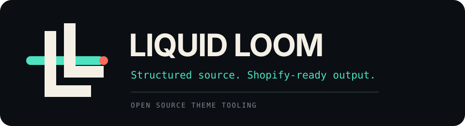
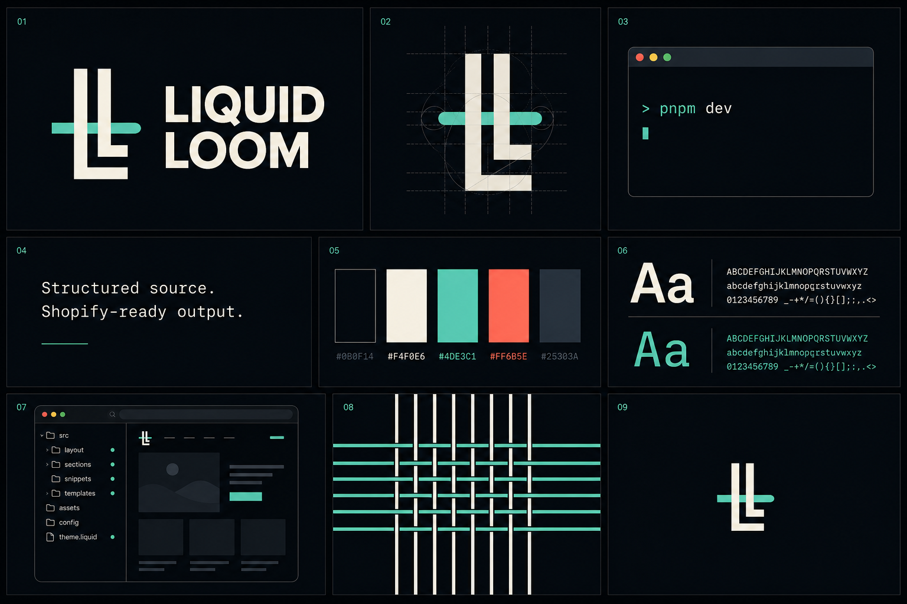

<p align="center">
  
</p>

<p align="center"><strong>Modern tooling for Shopify themes, whether you are starting fresh or working with the theme you already have.</strong></p>

<p align="center">
  <a href="https://www.npmjs.com/package/liquid-loom"></a>
  <a href="https://www.npmjs.com/package/liquid-loom"></a>
  <a href="https://github.com/yotamon/Liquid-Loom/releases/latest"></a>
  <a href="https://github.com/yotamon/Liquid-Loom/actions/workflows/ci.yml"></a>
  
  <a href="LICENSE"></a>
</p>

Liquid Loom gives Shopify theme development a safer, source-first build layer while keeping Shopify's runtime completely standard.

Use it to organize new code by feature, add modern tooling to an existing client theme without a rewrite, migrate gradually when it is worth it, and still ship a normal Shopify theme through Shopify CLI.

It does **not** replace Liquid, Online Store 2.0, or Shopify CLI.

## Start with the theme you already have

From an existing Shopify theme containing `layout/theme.liquid`:

```bash
npx liquid-loom@latest init
```

Liquid Loom shows the complete setup plan before writing anything. Existing Shopify source is not moved.

After setup, keep the current theme exactly as it is:

```text
assets/
layout/
sections/
snippets/
templates/
```

and put only new work into organized source when you want to:

```text
src/theme/sections/product/upsell.liquid
src/theme/snippets/product/upsell-price.liquid
```

Both become one normal deployable theme:

```text
existing Shopify source ----+
                             |
organized Liquid Loom source +--> deterministic ownership plan --> dist/theme --> Shopify CLI
```

Build with the namespaced script added by `init`:

```bash
npm run loom:build
```

Use your preferred package manager. `init` detects npm, pnpm, Yarn, or Bun and supports `--package-manager`, `--no-install`, `--dry-run`, `--theme-dir`, and `--yes`.

Read the full [existing-theme adoption guide](docs/EXISTING_THEME_ADOPTION.md).

## Or start a new theme

```bash
corepack enable
pnpm create liquid-loom@latest my-storefront
cd my-storefront
pnpm build
```

Then preview against a Shopify development store:

```bash
pnpm dev
```

The scaffolder supports `--package-manager npm|pnpm|yarn|bun` and `--no-install`.

## Why Liquid Loom

Liquid Loom targets the parts of custom theme development that become painful as projects and teams grow:

- **Adopt incrementally.** Existing themes do not need an up-front rewrite.
- **Feature-oriented source.** Organize authored Liquid by feature without inventing a new runtime.
- **Dual-source builds.** Native Shopify source and organized Liquid Loom source can coexist safely.
- **No silent precedence.** Every Shopify output path has exactly one owner.
- **No silent overwrites.** Destination collisions fail before a new build is published.
- **Last-known-good output.** Failed builds do not replace the previous working theme.
- **Transactional migration.** Preview first, preserve Shopify output identity, and roll back completed moves if a later move fails.
- **Optional Vite + Tailwind.** Fresh projects get the modern asset workflow; existing themes can keep their current pipeline.
- **Portable behavior.** Collision checks are case-insensitive and Unicode-normalized across filesystems.
- **Useful diagnostics.** `doctor`, `check`, `analyze`, Theme Check, and performance budgets make failures explainable.
- **Standard Shopify output.** `dist/theme` remains inspectable, pushable, and debuggable with Shopify's own tooling.

## The source model

A fresh Liquid Loom project can look like this:

```text
src/theme/sections/home/hero.liquid
src/theme/sections/product/recommendations.liquid
src/theme/snippets/product/price.liquid
src/entrypoints/theme.js
src/styles/theme.css
```

Liquid Loom produces:

```text
dist/theme/sections/hero.liquid
dist/theme/sections/recommendations.liquid
dist/theme/snippets/price.liquid
dist/theme/assets/theme.js
dist/theme/assets/style.css
```

An adopted project may simultaneously contain:

```text
sections/header.liquid
assets/legacy-theme.css
src/theme/sections/product/upsell.liquid
```

and produce:

```text
dist/theme/sections/header.liquid
dist/theme/sections/upsell.liquid
dist/theme/assets/legacy-theme.css
```

Shopify still receives the conventional structure it expects.

## One output, one owner

There is intentionally no "new source wins" rule.

This fails:

```text
sections/hero.liquid
src/theme/sections/home/hero.liquid
```

because both map to:

```text
sections/hero.liquid
```

Liquid Loom validates the global ownership plan before changing the last-known-good output and tells you which sources collide.

The same ownership model includes generated asset reservations when Vite is enabled.

## Migrate only when it helps

Preview migration of one file:

```bash
liquid-loom migrate sections/hero.liquid
```

Apply it:

```bash
liquid-loom migrate sections/hero.liquid --apply
```

Organize it during migration:

```bash
liquid-loom migrate sections/hero.liquid \
  --to theme/sections/home/hero.liquid \
  --apply
```

The Shopify output must remain `sections/hero.liquid`. If the requested destination would change the deployable path, Liquid Loom refuses the migration.

Migrate a directory:

```bash
liquid-loom migrate sections --apply
```

Or preview/apply all remaining native theme source:

```bash
liquid-loom migrate --all
liquid-loom migrate --all --apply
```

Liquid Loom never invents your feature taxonomy during bulk migration.

## Existing asset pipelines are allowed

Existing-theme initialization defaults to:

```js
import { defineConfig } from "liquid-loom";

export default defineConfig({
  shopifySourceDir: ".",
  sourceDir: "src",
  outputDir: "dist/theme",
  viteConfig: false,
  performance: false
});
```

That means native `assets/*` pass through unchanged and your existing Sass/PostCSS/Webpack/Vite process can keep running independently.

Fresh projects still use Liquid Loom's Vite + Tailwind workflow by default.

If `src/entrypoints` exists while Vite is disabled, `doctor` warns that those files are not being compiled.

## Shopify mapping contract

| Authoring source | Deployable Shopify path | Rule |
| --- | --- | --- |
| `sections/hero.liquid` | `sections/hero.liquid` | Native Shopify identity mapping |
| `src/theme/sections/home/hero.liquid` | `sections/hero.liquid` | Organized source flattens by filename |
| `src/theme/snippets/product/price.liquid` | `snippets/price.liquid` | Organized source flattens by filename |
| `src/theme/config/editor/settings_schema.json` | `config/settings_schema.json` | Flatten by filename |
| `src/theme/locales/markets/en.default.json` | `locales/en.default.json` | Flatten by filename |
| `src/theme/templates/catalog/product.json` | `templates/product.json` | Feature folders flatten |
| `templates/customers/account.json` | `templates/customers/account.json` | Preserve Shopify-supported nesting |
| `src/theme/templates/metaobject/book.json` | `templates/metaobject/book.json` | Preserve Shopify-supported nesting |
| `src/public/icons/cart.svg` | `assets/cart.svg` | Flatten passthrough assets |
| `src/entrypoints/theme.js` + `src/styles/*.css` | `assets/theme.js` + `assets/style.css` | Vite-generated outputs when enabled |

Framework validation checks Shopify's upload minimum from the final ownership plan: `layout/theme.liquid` must exist in deployable output, regardless of which source layer owns it.

For Shopify's canonical directory rules, see the official [theme architecture documentation](https://shopify.dev/docs/storefronts/themes/architecture).

## Build guarantees

### Complete planning before publish

Source discovery, Shopify path validation, traversal guards, collision detection, and generated-output reservations happen before a new output is promoted.

### Last-known-good output

Static mapping and optional Vite bundling happen in isolated staging paths. Output and cache are promoted together only after the build succeeds.

### Safe concurrent builds

Independent CLI processes serialize through a recoverable project lock. An abandoned lock from a terminated process is detected and removed.

### Migration-safe caching

Hybrid manifests track source-layer identity. Moving ownership from:

```text
sections/hero.liquid
```

to:

```text
src/theme/sections/home/hero.liquid
```

does not cause `sections/hero.liquid` to be removed as stale.

### Consumer-shaped release validation

CI packs the actual npm artifacts, installs both CLIs into independent temporary projects, validates a fresh scaffold, and validates an existing-theme `init -> hybrid build -> migrate -> build` flow.

Releases use npm Trusted Publishing with GitHub OIDC and signed provenance.

## Configuration

Fresh project example:

```ts
import { defineConfig } from "liquid-loom";

export default defineConfig({
  sourceDir: "src",
  outputDir: "dist/theme",
  performance: {
    maxBuildMs: 10_000,
    maxThemeBytes: 5_000_000,
    maxAssetBytes: 500_000
  }
});
```

Existing theme in a monorepo:

```ts
export default defineConfig({
  shopifySourceDir: "theme",
  sourceDir: "src",
  outputDir: "dist/theme",
  viteConfig: false,
  performance: false
});
```

All paths remain project-relative and portable.

## Commands

| Command | Purpose |
| --- | --- |
| `liquid-loom init` | Add Liquid Loom to an existing Shopify theme without moving source |
| `liquid-loom migrate [target]` | Preview or apply output-preserving source migration |
| `liquid-loom build` | Build the merged deployable Shopify theme |
| `liquid-loom build --clean` | Build from empty staging |
| `liquid-loom watch` | Rebuild when managed source changes |
| `liquid-loom dev` | Build, watch, and launch `shopify theme dev` |
| `liquid-loom doctor` | Diagnose runtime, ownership, config, safety, assets, and privacy |
| `liquid-loom check` | Validate ownership, source JSON, and build output |
| `liquid-loom analyze` | Report output composition and largest files |
| `liquid-loom clean` | Remove generated output and cache safely |

Scaffolded projects expose package-manager scripts for the same commands. Existing-theme `init` uses namespaced `loom:*` scripts so it does not replace a project's existing `build` or `dev` commands.

## Who it is for

Liquid Loom is a good fit when you:

- maintain a custom or client Shopify theme and want better tooling without rewriting it;
- want new theme work organized by feature rather than only by Shopify's flat directories;
- want deterministic build ownership and explicit collision behavior;
- expect modern frontend build and CI guarantees from the rest of your stack.

It is probably not the right starting point when:

- the theme is tiny and needs no build pipeline;
- you are building a headless storefront rather than a Shopify Liquid theme;
- your primary goal is Shopify Theme Store submission, where Shopify's official starting points and policies should remain authoritative.

## Reference storefront

The fresh-project scaffolder includes a merchant-neutral Online Store 2.0 reference theme with theme blocks, JSON templates, editable header/footer groups, storefront filtering, predictive search, variant URL state, selling plans, responsive images, semantic navigation, reduced-motion support, visible focus states, and no-JavaScript fallbacks.

It is a reference implementation. The product is the tooling and workflow.

## Validation and feedback

Liquid Loom is being validated against real Shopify workflows, not just repository metrics.

Useful evidence includes:

- a successful public-package install;
- a real Shopify development-store preview;
- existing-theme adoption without source migration;
- incremental migration on a real client-style repository;
- developers independently choosing the workflow again.

If you try it, feedback about what is confusing, slower, or worse is especially useful.

- [Run the first-project test](docs/FIRST_PROJECT.md)
- [Read the existing-theme adoption guide](docs/EXISTING_THEME_ADOPTION.md)
- [Share first-project feedback](https://github.com/yotamon/Liquid-Loom/issues/new?template=early_adopter_feedback.yml)
- [Report a bug](https://github.com/yotamon/Liquid-Loom/issues/new?template=bug_report.yml)
- [Start a discussion](https://github.com/yotamon/Liquid-Loom/discussions)

## Documentation

- [Existing-theme adoption](docs/EXISTING_THEME_ADOPTION.md) - zero-migration setup, hybrid source, and safe migration
- [First project](docs/FIRST_PROJECT.md) - short evaluation from public install to a real source edit
- [Architecture](docs/ARCHITECTURE.md) - ownership, transactions, cache, and migration invariants
- [Validation](docs/VALIDATION.md) - real-user and real-store validation plan
- [Recipes](docs/RECIPES.md) - entrypoints, static assets, private-term policies, and budgets
- [Troubleshooting](docs/TROUBLESHOOTING.md) - collisions, locks, Shopify CLI, and build failures
- [Benchmarks](docs/BENCHMARKS.md) - reproducible build measurements
- [Releasing](docs/RELEASING.md) - provenance-backed npm release process
- [Contributing](CONTRIBUTING.md) - development and pull-request expectations
- [Security](SECURITY.md) - private vulnerability reporting

## Design principles

- Adopt tooling before forcing migration.
- Source ownership must be explicit.
- Shopify's runtime contract stays visible.
- Generated output is disposable; authored source is the product.
- Fail early, explain specifically, and preserve the last-known-good build.
- Prefer a dependable core over speculative abstractions.
- Add framework surface only after real users demonstrate the need.

<p align="center">
  
</p>

## License

MIT © 2026 Liquid Loom contributors.
