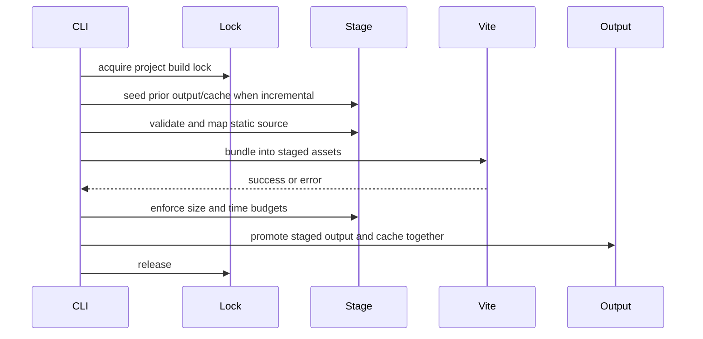

# Architecture

Liquid Loom has three boundaries: authoring source, build orchestration, and deployable Shopify output.

## Invariants

1. Every supported source file maps to exactly one portable output path.
2. A complete plan is validated before any source file is published.
3. Generated assets and static assets cannot own the same output.
4. A failed build cannot modify the last-known-good theme or cache.
5. Clean operations cannot target the source tree, repository root, or a path outside the project.
6. The installed CLI always operates on the consuming working directory.

## Build transaction

Each transaction uses unique sibling staging and backup paths on the same volume, allowing directory renames instead of partial file publication. If promotion fails, both prior output and prior cache are restored.

## Mapping

`theme-builder.js` normalizes separators, rejects traversal, maps source categories, and canonicalizes destination keys with Unicode NFC plus locale-independent lowercase comparison. The original display path remains available in errors, while canonical keys enforce portability.

## Cache

The manifest records the SHA-256 content hash, output path, and byte length of every mapped file. A file is skipped only if hash and path match and the expected staged output exists. Stale outputs are removed through path-guarded manifest resolution.

## Configuration

`liquid-loom.config.ts`, `.mts`, `.js`, or `.mjs` is loaded from the consuming project. Defaults are resolved against `process.cwd()`. The public `defineConfig` API and declarations provide editor completion without requiring TypeScript in the theme runtime.

## Packages

- The repository root publishes `liquid-loom` and exposes the CLI plus programmatic build APIs.
- `packages/create-liquid-loom` publishes the scaffolder and an embedded, versioned starter.
- Package smoke validation installs the root tarball into a new embedded starter and runs a real build.

## Extension strategy

Prefer explicit configuration and small programmatic APIs. New source categories require mapping tests, collision semantics, documentation, and package-smoke coverage. Store-specific behavior belongs in the consuming theme, not in the framework core.
